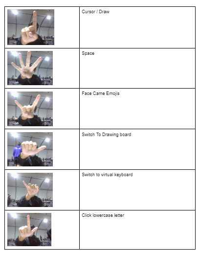
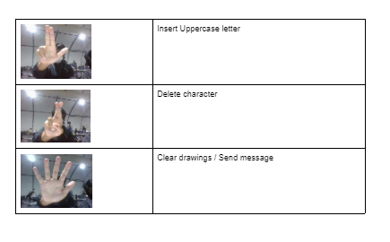

## Emoticam: An accessible, keyboard-free, communication tool
#### By: Brendan Lieu, Andy Phung, Kyle Carbonell, and Nicholas Bui

### About:
#### Using OpenCV facial recognition, users can make hand gestures or facial expressions toward their webcam and our program will convert it into emojis, automatically sending their selected recipient.

### Installation
```
git clone https://github.com/andy-phung/emoticam.git
cd emoticam
sudo pip install -r requirements.txt 
```

### Usage
```
sudo python main.py
```
Press `n` to activate hand gesture recognition, and `a` to activate facial expression recognition and air typing. Note that only one can be active at any given time. Press `esc` to exit the current recognition algorithm.

### Hand Gesture Key (Hand -> Emoji)


### Face Expression Key (Face -> Emoji)


### Hand Control Key (Hand -> Character)



### Reference
* [MediaPipe](https://mediapipe.dev/)
* Kazuhito Takahashi(https://twitter.com/KzhtTkhs)
* Nikita Kiselov(https://github.com/kinivi)
 
### License 
hand-gesture-recognition-using-mediapipe is under [Apache v2 license](LICENSE).


