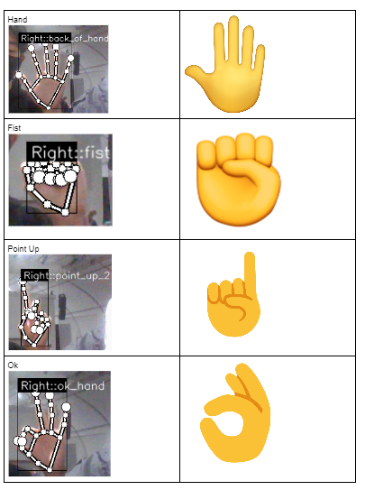
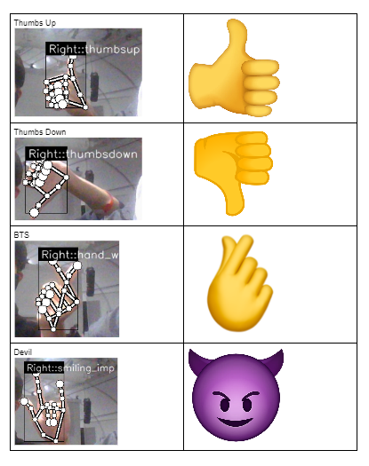

## Emoticam: An accessible, keyboard-free, communication tool
#### By: Andy Phung, Brendan Lieu, Kyle Carbonell, and Nicholas Bui

### About:
#### Using OpenCV facial recognition, users can make hand gestures or facial expressions toward their webcam and our program will convert it into emojis, automatically sending their selected recipient.

### How to Use:

### How to train your own expressions/gestures:
* Open keypoint_classifier_label.csv 
* Add a new line and add your new hand/face gesture name
* Run app.py
* Click 'K' to activate training mode and then click the number cooresponding the line number of your new gesture name 
* Keep clicking that number until you have sufficient data, stored in keypoint.csv
* Open jupyter and run keypoint_classification.ipynb to train
* Rerun app.py and your new expression/gesture should be detected

### Hand Gesture Key (Hand -> Emoji)

### Face Expression Key (Face -> Emoji)

### Reference
* [MediaPipe](https://mediapipe.dev/)
* Kazuhito Takahashi(https://twitter.com/KzhtTkhs)
* Nikita Kiselov(https://github.com/kinivi)
 
### License 
hand-gesture-recognition-using-mediapipe is under [Apache v2 license](LICENSE).

